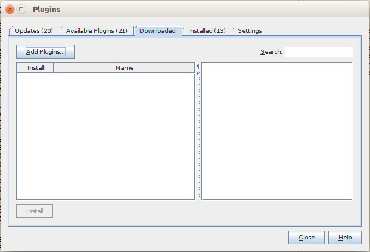
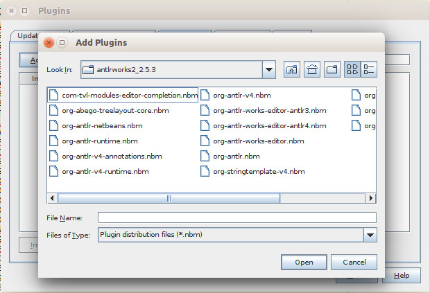
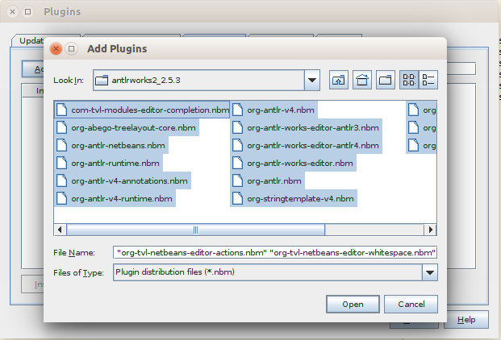
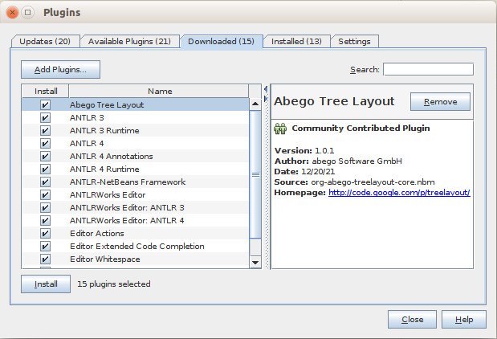
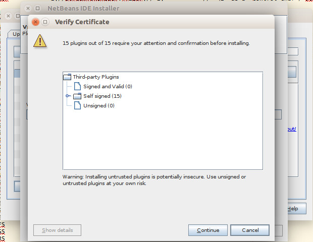
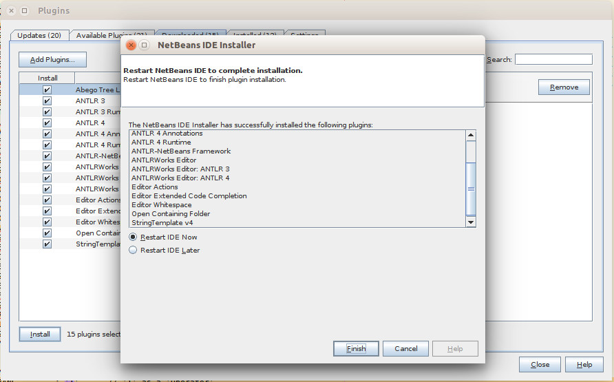

# 
# antlrworks2 

**antlrworks2** plugin for the **Netbeans IDE**

## Abstract

This repository is about building the antlrworks2 Netbeans plugin against all Netbeans platform versions (currently only for Netbeans 8.2 - I can build against other Netbeans versions upon reguest).
**antlrworks2** (created by [Sam Harwell](https://github.com/tunnelvisionlabs/antlrworks2)) is a Netbeans plugin that provides support for editing/development of ANTLR-based grammars/lexers.
I decided to build this project against Netbeans (currently only against 8.2) so that you can enjoy this plugin without diving into the problematic nature of this project (to be built properly - some people develop plugins that they cannot even know the underlying nature of the platform that they built it against - thus they put other people into troubles). That's why i decided to build it properly once and for all for Netbeans (currently only for 8.2).

## What this repository provides

This repository contains the NBM files to be installed in your Netbeans IDE (currently only for Netbeans 8.2) for the antlrworks2 plugin to be installed.

## How to install the plugin

1. Navigate into the [`distributions`](./distributions) directory and select the version of the plugin (for example **`antlrworks2_2.5.3.zip`**)
2. Download the ZIP file containing all NBM files and its corresponding SHA512 checksum (for example **`antlrworks2_2.5.3.zip`** + **`antlrworks2_2.5.3.zip.sha512`**)
3. Verify that your downloaded file is not corrupt:
 >
 ```console
 $ sha512sum -c antlrworks2_2.5.3.zip.sha512
 ```
 You should see:
  >
 ```console
 antlrworks2_2.5.3.zip: OK
 ```
4. Unzip the ZIP file
5. Start your Netbeans 8.2 IDE
6. Got to ***"Tools > Plugins"***. Select the ***"Downloaded"*** tab:
 > 
7. Click ***"Add plugins..."***
8. Navigate to the folder where you extracted the NBM files:
 > 
9. Press Ctrl+A to select all NBM files in this directory
 > 
10. Click **"Open"**
 > 
 > Now all NBM files are ready to be installed. Just click **"Install"**
11. Click **"Next"**
12. Accept the license agreement and click **"Install"**.
13. Click **"Continue"**:
 > 
14. Click **"Finish"** to restart your IDE:
 > 
15. Enjoy!
